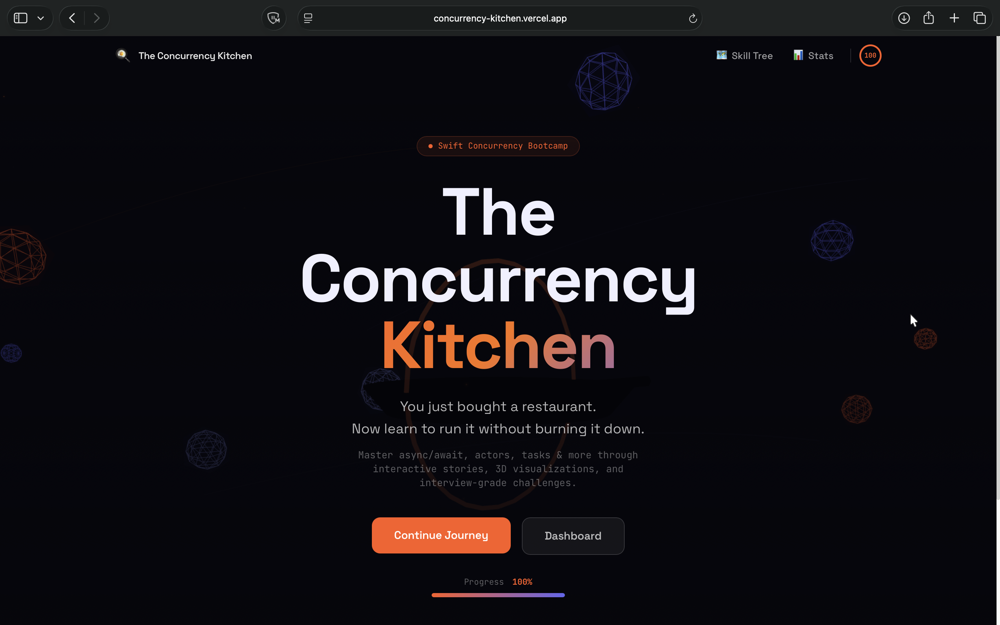
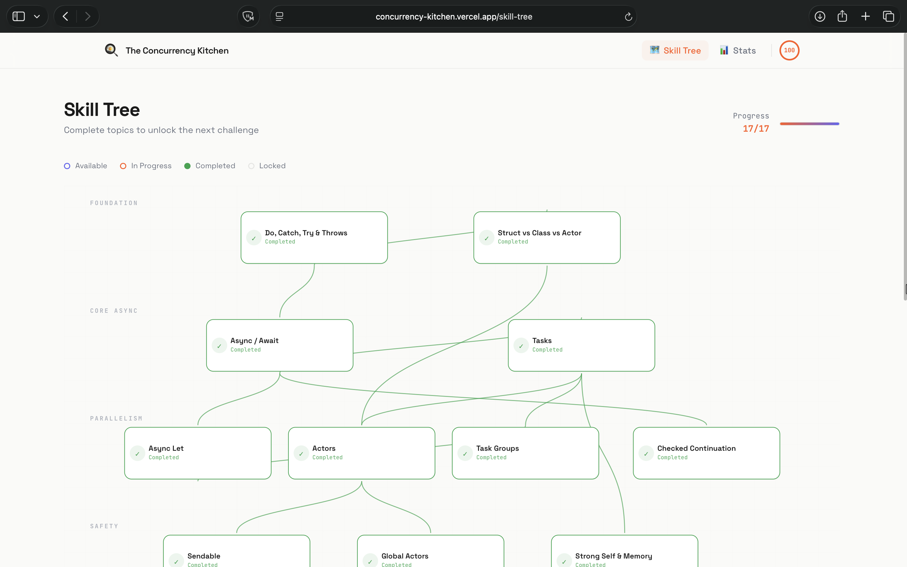
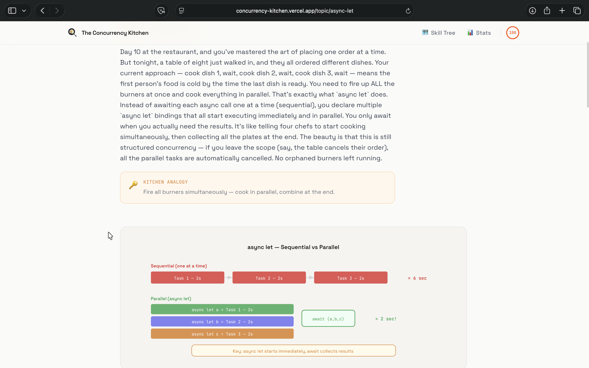
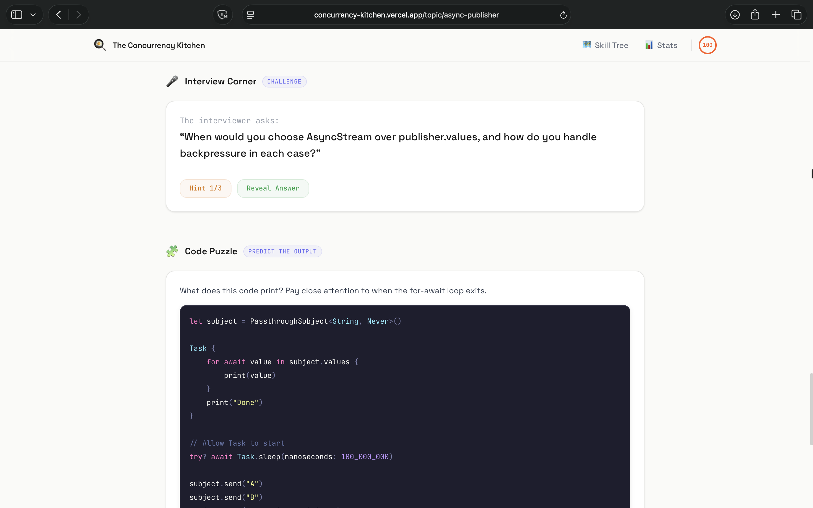

# The Concurrency Kitchen

**Master Swift Concurrency through interactive stories, visual diagrams, and interview-grade challenges.**

> You just bought a restaurant. Now learn to run it without burning it down.

**[Try it live](https://concurrency-kitchen.vercel.app)**

### Landing Page


### Skill Tree — 17 Topics Across 7 Tiers


### Topic Page — SVG Diagrams & Kitchen Analogies


### Interactive Code Stepper with Thread Indicators


---

## What is this?

The Concurrency Kitchen is an interactive learning platform that teaches Swift Concurrency from zero to senior level. Every concept is explained through a restaurant/kitchen metaphor, making abstract concurrency patterns intuitive and memorable.

This isn't another docs page. It's a full learning experience with:

- **17 chapters** covering everything from `try/catch` to `PhotosPicker`
- **Interactive code walkthroughs** — step through code line by line with thread indicators
- **"What Happens Next?" exercises** — predict what code does, get instant feedback
- **"Fill the Keyword" challenges** — fill in `async`, `await`, `try`, `throws` in real code
- **Quick Check cards** — true/false micro-quizzes between sections
- **Interview prep** — senior-level questions with progressive hints and model answers
- **Code puzzles** — predict-output and spot-the-bug challenges
- **SVG concept diagrams** — visual flowcharts for every topic
- **Skill tree** — prerequisite-based progression across 7 tiers
- **Progress tracking** — streaks, completion percentage, time invested

---

## The Curriculum

### Foundation
| Topic | What You'll Learn |
|-------|-------------------|
| **Do, Catch, Try & Throws** | Error handling evolution: tuples to Result to throws. The three flavors of try. |
| **Struct vs Class vs Actor** | Value types, reference types, and isolated types. Stack vs heap. Why actors exist. |

### Core Async
| Topic | What You'll Learn |
|-------|-------------------|
| **Async / Await** | Suspension points, thread freeing, MainActor. Why await != blocking. |
| **Tasks** | Units of concurrent work. Priorities, cancellation, structured vs unstructured. |

### Parallelism
| Topic | What You'll Learn |
|-------|-------------------|
| **Async Let** | Fixed parallel execution. Fire all burners simultaneously. |
| **Actors** | Thread-safe isolated state. Serial access, no data races. |
| **Task Groups** | Dynamic parallelism. Spawn N tasks, collect results in completion order. |
| **Checked Continuation** | Bridge callback/delegate APIs to async/await. The one-resume rule. |

### Safety
| Topic | What You'll Learn |
|-------|-------------------|
| **Sendable** | Thread-safe data transfer. @unchecked Sendable with manual synchronization. |
| **Global Actors** | @MainActor, custom global actors, isolation inheritance, nonisolated. |
| **Strong Self & Memory** | Retain cycles, [weak self] in Tasks, .task modifier auto-cancellation. |

### Architecture
| Topic | What You'll Learn |
|-------|-------------------|
| **MVVM** | @MainActor ViewModel + actor Model + SwiftUI View. Task lifecycle management. |

### Applied
| Topic | What You'll Learn |
|-------|-------------------|
| **Download Image Async** | Three eras: completion handlers, Combine, async/await. Actor-based caching. |
| **Async Publisher** | Combine to AsyncSequence bridge. AsyncStream with continuations. |

### SwiftUI Integration
| Topic | What You'll Learn |
|-------|-------------------|
| **Refreshable** | Pull-to-refresh with .refreshable. Spinner lifecycle gotchas. |
| **Searchable** | .searchable with debounce via Task.sleep + .task(id:). Race condition prevention. |
| **Photo Picker** | PhotosPicker + Transferable. Two-phase design: instant selection, async loading. |

---

## Features

### Interactive Code Stepper
Step through Swift code line by line. Each step highlights the active lines, shows which thread is executing (main, background, or suspended), and explains what's happening in plain English.

### SVG Concept Diagrams
Every topic has a clean, educational diagram. Error handling flows, async/await timelines, actor isolation models, memory diagrams — all rendered as crisp SVGs that actually teach.

### Gamified Exercises
- **"What Happens Next?"** — Code executes line by line. You predict the outcome from emoji-labeled options. Confetti on correct answers.
- **"Fill the Keyword"** — Swift code with blanks. Pick the right keyword from pill buttons. Instant feedback.
- **"Quick Check"** — True/false cards between sections. Takes 3 seconds, builds confidence.

### Interview Prep
Every chapter includes a senior-level interview question with:
- 3 progressive hints (reveal one at a time)
- A detailed model answer
- 3 follow-up questions the interviewer might ask

### Skill Tree
Visual prerequisite graph showing all 17 topics across 7 tiers. Tracks completion status with color-coded nodes. Shows your learning path at a glance.

### Progress Dashboard
- Completion ring with percentage
- Day streak counter
- Time invested tracker
- 90-day activity heatmap
- Full topic status list

---

## Tech Stack

| | |
|---|---|
| **Framework** | Next.js 16 with React 19 |
| **Styling** | Tailwind CSS 4 with custom design tokens |
| **Animations** | Framer Motion 12 |
| **3D** | Three.js + React Three Fiber (landing page) |
| **State** | Zustand with localStorage persistence |
| **Language** | TypeScript 5 |
| **Deployment** | Vercel |

---

## Getting Started

```bash
# Clone the repo
git clone https://github.com/venusbhatia/learn-swift-concurrency.git
cd learn-swift-concurrency

# Install dependencies
pnpm install

# Start dev server
pnpm dev

# Open http://localhost:3000
```

---

## Project Structure

```
src/
  app/                    # Next.js pages (landing, skill-tree, dashboard, topic/[slug])
  components/
    ui/                   # GlassCard, NeonButton, ProgressRing, XPToast
    layout/               # Navbar, PageTransition, StoreHydration
    topic/                # CodePlayground, WhatHappensNext, FillKeyword, QuickCheck,
                          # InterviewQuestion, CodePuzzle, MarkCompleteButton, ConceptScene
    skill-tree/           # SkillNode, SkillEdge, SkillTreeGraph
    landing/              # HeroScene (Three.js)
    three/scenes/         # 3D topic visualizations
  data/
    topics.ts             # Topic registry (17 topics with metadata)
    topics/               # Individual topic content files (~250 lines each)
    skill-tree-layout.ts  # Node positions and edge definitions
  lib/
    progress-store.ts     # Zustand store with persist middleware
    swift-highlight.ts    # Custom Swift syntax tokenizer
    constants.ts          # Color palette and topic slugs
  hooks/
    useCodeStepper.ts     # Code walkthrough playback state
    useTopicUnlock.ts     # Prerequisite-based topic availability
  types/
    topic.ts              # Topic, CodeBlock, InterviewQuestion, exercise types
    progress.ts           # UserProgress, TopicProgress, StreakData
```

---

## Design Philosophy

1. **Kitchen metaphor everywhere** — Every concept maps to running a restaurant. Async/await is a waiter system. Actors are isolated chef stations. Sendable is food safety labels. The metaphor makes abstract concepts concrete.

2. **Learn by doing** — Reading is passive. Predicting what code does, filling in keywords, and solving puzzles is active. Every chapter has 3+ interactive exercises.

3. **Interview-ready** — Every topic includes the exact question a senior iOS interviewer would ask, with the exact answer that would impress them.

4. **Progressive disclosure** — The skill tree enforces prerequisites. You can't skip to Actors without understanding Tasks. This prevents the "I know the syntax but not the concepts" trap.

5. **Light, clean design** — Warm off-white backgrounds, coral/indigo accent colors, generous whitespace. Code blocks stay dark (industry standard). No neon glows or dark mode gamer aesthetic.

---

## License

MIT

---

Built with [Claude Code](https://claude.ai/code)
